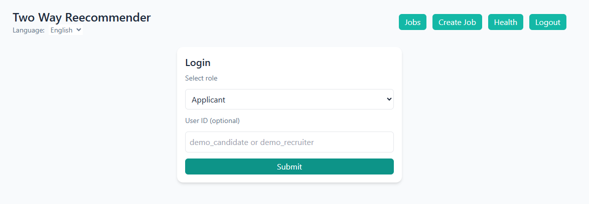
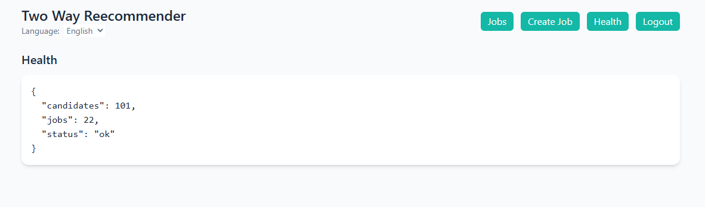
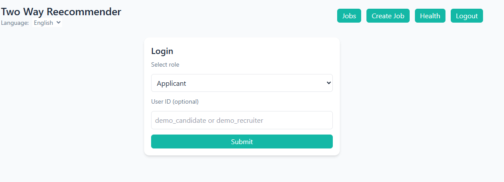
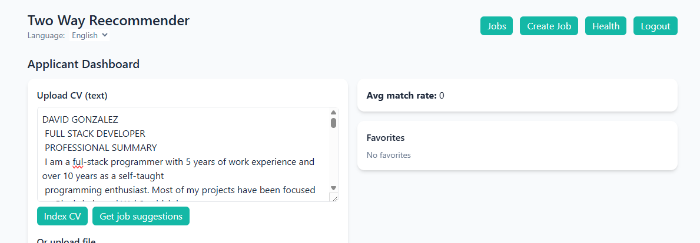
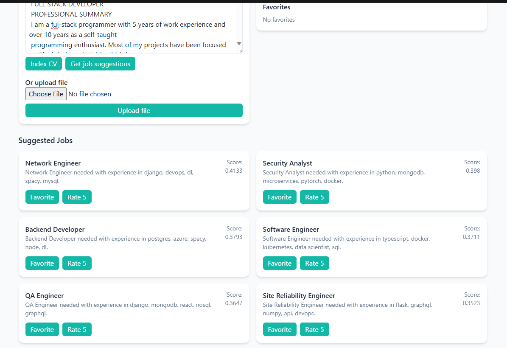
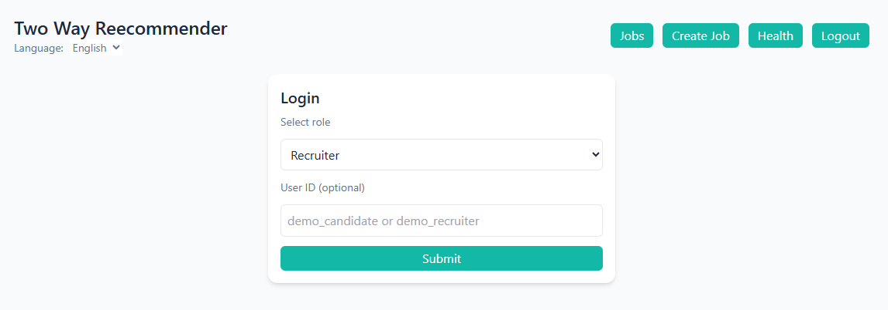
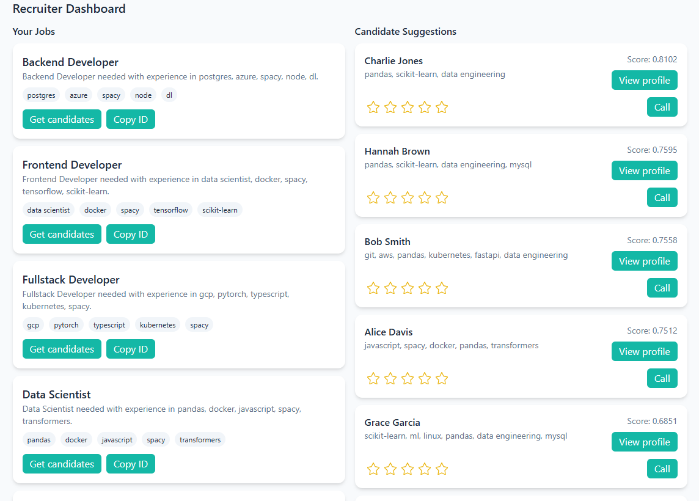

# Two-Way Recommender System  
A lightweight AI-powered recommendation engine that matches **profiles ↔ jobs** using embeddings, semantic search, and feedback loops.  
Backend built with **Python + Flask + FAISS + UV**.  
Frontend powered by **React**.

---

## Development Setup

This project uses **UV** — a modern, extremely fast alternative to pip + venv.  
Highly recommended for Python development.

UV Documentation:  
https://docs.astral.sh/uv/getting-started/installation/

---

## Backend Setup (Python + UV)

### 1. Create a virtual environment (Python 3.11)
```bash
uv venv --python 3.11
```
### 2. Activate env
```bash
.venv\Scripts\activate
```
### 3. Install dependecies 
uv sync
```
### 4. Run project 
uv run flask run
```
### The API will start in:
http://127.0.0.1:5000
```
## Frontend Setup (React)

Copy `.env.example` to `.env` and set `VITE_API_URL` if your backend is running on another host. for default is running in localhost:5000


```bash
cd frontend
npm install
npm run dev
```

### Front end runs at
http://localhost:3000

## How it works?
Once you launched the front end app, youre going to see next screen:


Lets check that everything is working as expected, so lets click on Health button, you should see the status of the indexed resumes and jobs.


If you are not seeing a null value all is working, so click on logout button to return to main screen.


## Getting a recommendation as Applicant
In here youre going to select applicant and click submit


Once logged in, copy a resume text and paste it on the text area.
Click on get job suggestions



Youre going to receive job suggestions based on the text of your resume:


## Getting Resumes Recommendations based on a Job Description
In here youre going to select recruiter and click submit


Once logged in, youre going to see a list of job openings that you have created, lets click on get candidates button of any of your job openings.


Youre going to receive resume sugestions based on the job description and the skills on resumes:
