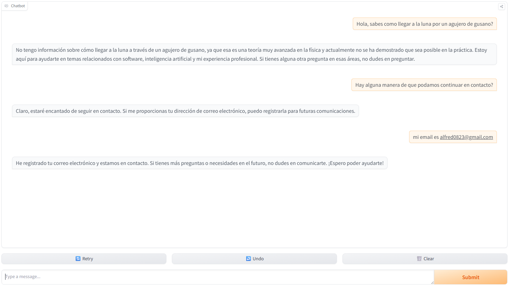

# Virtual Me deployed on Huggingface
## you can chat with virtual me here: https://huggingface.co/spaces/sibok/chat

# Notes
This folder contains the minimal config needed to deploy a project to hugging face spaces.

When using the uv package manager you need to keep the project folder structure to avoid gradio trying to upload your .venv folder

Added .uvignore to put in here all the folders that we want to omit on uploading to hugging face.

In this particular I have only keept the main chat(without evaluator agent) uncluiding the of tools by specifiying json functions.

I have integrated pushover api to seend push notification to my cellphone when someone ask question that the bot cannot answer and when the user want to be in touch and provides his email.

Also added next libraries or request for specific version of the libraries due to compatibility with Huggingface.
```bash
requests>=2.32.4
gradio>=4.0,<5.0
huggingface_hub>=0.19,<0.23
```
Huggingface need the requirements.txt to install the requirements

# Creating a deployment to huggingfaces
If you need to create a deployment you should follow next steps:
1.-Install Huggingface CLI
2.-Generate an API token
3.- Login by Huggingface CLI
4.- execute
```bash
uv run gradio deploy
```

#Check next questions to fire the call of tools:


#This is th result of tooling calls in the pushover app:
